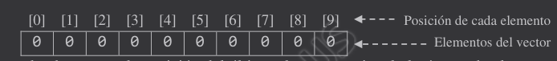
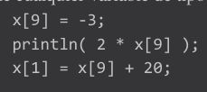
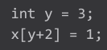
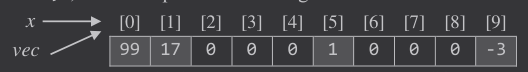

# Datos de Contacto
- David Ragel Díaz-Jara
- dragel@us.es
- Tutorías
  - Aula D3.6 Cuarta planta Edif. Azul CATEPS
  - M 19:15 - 21:00 (tras la clase)
  - X  8:00 - 12:15

# Práctica 4.2
https://github.com/daradija/diseno2024/blob/main/p4_2.md

- Terminar los ejercicios de prácticas anteriores.
- Leer el documento.

```
setup()
final int float String
+ - * / =
print println
void funcion(int v){}
funcion(4);
if else switch
while(contador<veces){
  ...
}
for(int i;i<10;i++){
  ...
}
do{
  ...
}while(num<0 || 9<num);


conversiones de tipos: int(), float()

```

Código movercara:
```
int cIncx = 2;
int cIncy = 3;
int cPosx;
int cPosy;
int cRadio;
boolean cFeliz = false;

void setup() {
  frameRate(30);
  size(500, 500);
  cPosx = width / 2;
  cPosy = height / 2;
  cRadio = width/5;
}

void draw() {
  background(180);  
  cara( cPosx, cPosy, cRadio, cFeliz );
  cPosx = cPosx + cIncx;
  cPosy = cPosy + cIncy;
  
  if (cPosx + cRadio >= width || cPosx - cRadio <= 0) {
    cIncx = -cIncx;
    cFeliz = !cFeliz;
  }
  if (cPosy + cRadio >= height || cPosy - cRadio <= 0) {
    cIncy = -cIncy;
    cFeliz = !cFeliz;
  }
}

void cara( int x, int y, int radio, boolean feliz ) {
  int diametro = 2*radio;
  strokeWeight(2);  
  fill( 255, 255, 0 );
  circle( x, y, diametro );
  fill( 0, 0, 0 );
  if (feliz) {
    circle( x-diametro/4, y-diametro/6, diametro/10 );
    circle( x+diametro/4, y-diametro/6, diametro/10 );
    arc( x, y+diametro/15, diametro/1.7, diametro/1.7, 0, PI );
  }else {
    ellipse( x-diametro/4, y-diametro/6, diametro/10, diametro/15 );
    ellipse( x+diametro/4, y-diametro/6, diametro/10, diametro/15 );
    noFill();
    arc( x, y+diametro/4, diametro/1.7, diametro/3, PI, TWO_PI );
  }
}
```

# Teoría
```
int a;
a=5;

int[] x;
x=new int[10];

int a=5;

int[] x=new int[10];

x.length
// devuelve 10
```



| x[0]|x[1]|x[2]|x[3]|x[4]|x[5]|x[6]|x[7]|x[8]|x[9]
|---|---|---|---|---|---|---|---|---|---
|0|0|0|0|0|0|0|0|0|0






| x[0]|x[1]|x[2]|x[3]|x[4]|x[5]|x[6]|x[7]|x[8]|x[9]
|---|---|---|---|---|---|---|---|---|---
|0|17|0|0|0|1|0|0|0|-3

```
int[] vec;
vec=x;
```



Esto es muy importante!
Si se modifica vec, se modifica x porque ambos son lo mismo.

En la llamadas a funciones ocurre lo mismo. Pero inicialmente se creará un nuevo vector para el return.

# Ejercicio 1

```
import static javax.swing.JOptionPane.*;
strNum=showInpuutDialog("Introduzca el valor en posición "+i+":");

// Idea: Pregunta por el tamaño.

void setup(){
  size(800,200);
}

int[] vec=new int[tam];
int[] vec2={1,3,0,8};

// Recorrido de un vector
for(i=0;i<vec2.lengh;i++){
  v[i]
}

print() / println()
background(128);
text(que,x,y)
width height

int[] invierteVector(int[] v){
  ...
  return ...;
}

tam=vec2.lengh
```

| i | tam-i-1
|---:|:---
|0| 3
|1| 2
|2| 1
|3| 0

# Ejercicio 2

```
final float RADIO = 15;
frameRate(45);
new float[tam]
random(min,max)
fill(r,g,b)
circle(x,y,r)
line(x1,y1,x2,y2)
```

```
import static javax.swing.JOptionPane.*;

void setup() {
  size(500, 500);
  frameRate(45);
  // Solicitamos por teclado el número de partículas que se van a mostrar
  int numParticulas = int(showInputDialog("Escriba el número de partículas:"));

}

void draw() {
  background(200);

}

// Inicializa el vector con valores aleatorios entre minimo y maximo
void inicializa( float[] vector, float minimo, float maximo ) { 
  int i;
  for (i=0; i<vector.length; i++) {
    vector[i] = random(minimo, maximo);
  }
}
```

[](https://youtu.be/hTZsbSyPxz4)

# Ejercicio 3
Idea: Si la distancia es menor que el diámetro se intercambian las velocidades (inc).

# Ejercicio 4
Idea: En un recorrido sobre el vector recordar la fórmula de la inversión y comprar, cuando no sea una pareja igual es que no es capicua.
# Ejercicio 5
Una variable se inicializa con infinito:

float max=Float.NEGATIVE_INFINITY;

A partir de ahí un recorrido va actualizando max al valor máximo tras hacer una comparación.

# Ejercicio 6
Inversao del 5.

# Ejercicio 7 y 8
Triviales, viene semi resueltos en los ejemplos. Es para experimentar. Típicas funciones que entran en un examen.